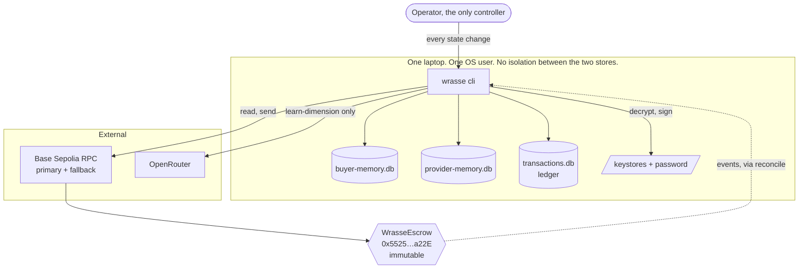

# 2. Context and containers

**Trust boundaries.** There are three that matter, and only one is enforced by anything other
than the code:

| Boundary | Enforced by | Strength |
|---|---|---|
| Operator to chain | The contract, and the keystore password | Real. Cryptographic. |
| Wrasse to RPC | Nothing. RPC is assumed unreliable, not assumed honest. | The design handles a slow or absent node, and trusts a single node on the safe head. |
| Buyer memory to provider memory | **Code only.** Same host, same user, same filesystem. | Protocol-level. See section 5. |

The hosted quote service, when it exists, sits outside this diagram entirely: it reads copies of
the two memory databases and holds no key, no ledger and no write path.
