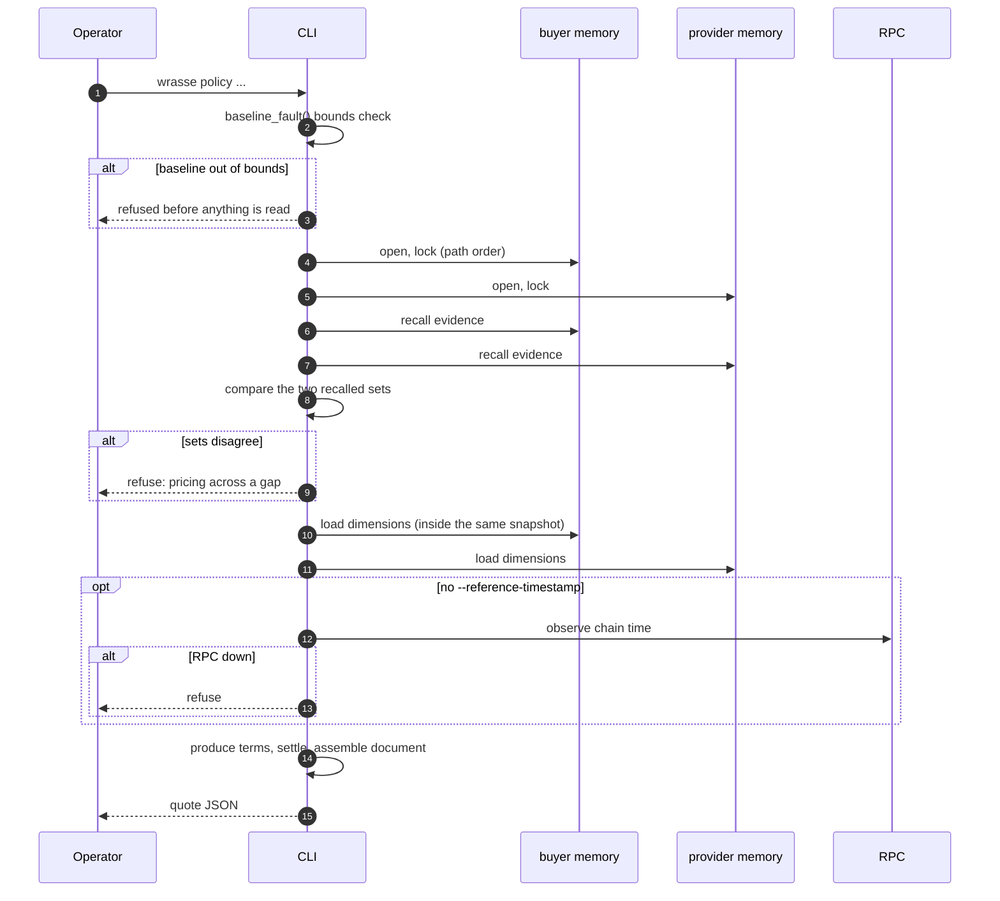
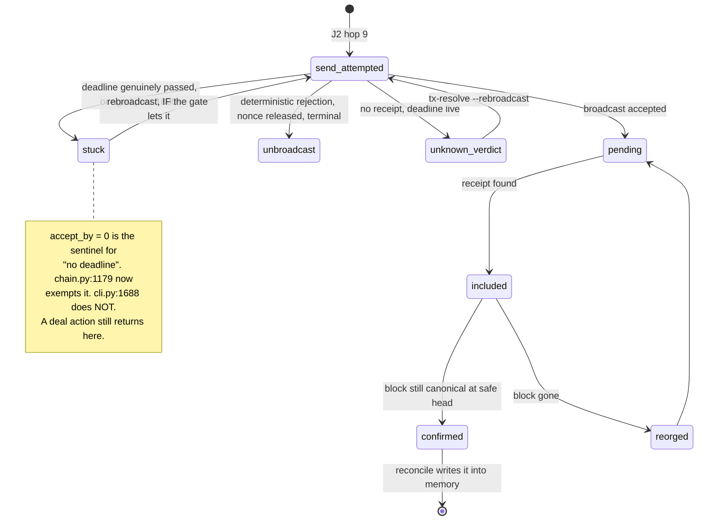

# 3. Journeys, hop by hop

Five. Two are read-only, two write to chain, one writes to memory. The operational journeys the
atlas template asks for (deploy, upgrade, pause, rollback) are covered by one sentence each in
section 3.6, because this system has none of them by design.

---

## J1. Produce a quote

Read-only. No wallet, no ledger, no writes. This is the journey the hosted service exposes.



| # | From to | Call | Timeout | Retry owner | Idempotent | On failure: state left | Detection | Runbook |
|---|---|---|---|---|---|---|---|---|
| 2 | cli to cli | bounds check | n/a | none | yes | nothing written | exit non-zero | none needed |
| 4-5 | cli to stores | `flock` + `RLock` | OS | none | yes | nothing; locks released | traceback | J1-a |
| 6-9 | cli to stores | read | n/a | none | yes | nothing | refusal text | J1-b |
| 10-11 | cli to stores | load dimensions | n/a | none | yes | nothing | refusal text | J1-c |
| 13 | cli to RPC | `eth_getBlockByNumber` | 20s per call, 72s total budget | `_read` wrapper, 3 attempts, backoff to 4s | yes | nothing | `ChainTimeUnavailable` | J1-d |

**Critical path:** all of it, but nothing here can leave partial state. A failure at any hop
leaves the stores exactly as they were.

**J1-a.** Two names for one database take one lock; the path is resolved first. If this hangs,
another `wrasse` process holds the lock. Find it, do not delete the lock file.

**J1-b.** "the two memories disagree on which receipts exist" means an ingest landed in one and
not the other. Run `reconcile` on both and re-quote. Do not quote across the gap.

**J1-c.** "holds verified events with no dimension yet" means a receipt arrived that has never
been learned. Run `learn-dimension <event_id>`. See J5 and its hazard.

**J1-d.** Pass `--reference-timestamp` and `--accept-by` to bypass the RPC entirely. This is the
switch that makes the quote path work with no network at all.

---

## J2. Create a deal

Writes to chain. The signing journey.

```mermaid
sequenceDiagram
  autonumber
  participant OP as Operator
  participant CLI
  participant LG as ledger
  participant MEM as both memories
  participant RPC
  OP->>CLI: WRASSE_ALLOW_BROADCAST=1 wrasse create-deal
  CLI->>CLI: validate policy.json as untrusted input
  CLI->>RPC: deployment identity by runtime bytecode hash
  alt bytecode mismatch
    CLI-->>OP: refuse; wrong build at that address
  end
  CLI->>MEM: hold BOTH locks
  CLI->>MEM: rebuild both halves of the document from memory
  alt cannot reproduce
    CLI-->>OP: refuse; the document is not from here
  end
  CLI->>CLI: check opt-in BEFORE recording
  CLI->>LG: BEGIN IMMEDIATE, allocate nonce, sign
  CLI->>LG: record_signed
  CLI->>LG: set send_attempted
  CLI->>RPC: eth_sendRawTransaction
  alt deterministic rejection
    CLI->>LG: mark_unbroadcast, release nonce
  else accepted
    CLI->>LG: set pending
  else uncertain
    Note over CLI,LG: row stays send_attempted.<br/>This is the recoverable state. See J3.
  end
  CLI->>MEM: release locks
```

| # | From to | Call | Timeout | Retry owner | Idempotent | On failure: state left | Detection | Runbook |
|---|---|---|---|---|---|---|---|---|
| 3 | cli to RPC | `eth_getCode` | 20s / 72s | `_read` | yes | nothing | refusal | J2-a |
| 5-6 | cli to memory | rebuild and compare | n/a | none | yes | nothing | refusal | J2-b |
| 7 | cli | opt-in check | n/a | none | yes | **nothing.** Fixed at d364896. | exception | J2-c |
| 8-9 | cli to ledger | `BEGIN IMMEDIATE` + sign | busy timeout 102s | SQLite | **no** | row written, nonce held | `WalletBusy` | J2-d |
| 11 | cli to RPC | `eth_sendRawTransaction` | 20s | **see hazard** | **no** | **the window** | none | **J3** |

**The window, stated exactly.** Between hop 9 (row recorded, nonce held) and hop 11 returning,
the process can die and the transaction may or may not be on the wire. That is the state J3
exists to resolve, and it is recovered without rebuilding or re-signing because the ledger holds
the signed bytes.

**Hazard, unresolved at d364896.** web3's `HTTPProvider` retries `eth_sendRawTransaction` by
default on connection errors and timeouts. The bytes are identical so this cannot double-fund,
but it means a single `_read`-budgeted operation can take far longer than 72s, and the ledger's
102s busy timeout is then smaller than the work it guards. Set
`exception_retry_configuration=None` on the provider, or accept and document it.

**J2-a.** The address holds different code than the reviewed build. Do not force it. Check
`deployments/base-sepolia.json` against the address you configured.

**J2-b.** `create-deal` refuses any document it cannot rebuild from the two memories. This is
the provenance gate and it is working as designed. If it fires, the `policy.json` is stale or
edited. Re-run `policy`.

**J2-c.** Running without `WRASSE_ALLOW_BROADCAST=1` raises and now leaves the ledger untouched.
Before d364896 it left a phantom row holding a nonce. The test that proves it asserts the *next*
attempt succeeds, not merely that the exception was raised.

**J2-d.** One unresolved transaction per wallet. `WalletBusy` means finish the previous one with
`tx-resolve` first. This is correct behaviour, not a fault.

---

## J3. Resolve an unresolved transaction

**The 3am journey.** Read this one first when something is stuck.



### The recovery decision tree

```
wrasse tx-status                    # what does the ledger think
wrasse tx-resolve                   # ask the chain, no send
```

| Verdict | Meaning | Do |
|---|---|---|
| `confirmed_success` | Settled | `wrasse reconcile` to write it into memory |
| `confirmed_reverted` | Settled, reverted | Read `last_error`. Terminal. Start a new attempt. |
| `included_*` | In a block, not yet safe | Wait, run `tx-resolve` again |
| `pending` | Node has it | Wait |
| `unknown` + `may_rebroadcast: true` | No receipt, deadline live | `wrasse tx-resolve --rebroadcast` |
| `nonce_conflict_pending` | Another tx occupies the nonce | **Needs the fallback RPC configured.** Without it there is no exit. |
| `unbroadcast` | Never sent, nonce released | Terminal and safe. Re-run the original command. |
| `stuck` | Deadline passed, or aged out | See below |

### If a wallet is stuck

1. Was this a **deal action** (`accept-deal`, `mark-delivered`, `release-deal`, `claim-payment`,
   `claim-timeout`, `cancel-unaccepted`, `withdraw`)? Those are signed with `accept_by = 0`,
   meaning no deadline. `stuck` for a "passed deadline" is then wrong.
   **At d364896 the verdict gate is fixed and the rebroadcast gate at `cli.py:1688` is not.**
   `tx-resolve --rebroadcast` will set it straight back to `stuck`. This is the one recovery
   path in the system that does not currently work.
2. Was it a `create-deal` whose `accept_by` genuinely expired? Then `stuck` is correct. The
   nonce is held because the bytes may still be live. Burning it requires a replacement
   transaction at the same nonce, sent with another tool.
3. `nonce_conflict_pending` with no fallback RPC configured: configure one and re-run. The
   design requires two endpoints to agree before abandoning a nonce, deliberately.

**Confirmation policy.** `safe_head_policy` reads the chain's own `safe` tag and fails closed if
the node has none. It trusts one node for this, while abandonment requires two. The asymmetry
runs toward the answer that becomes memory.

---

## J4. Reconcile a receipt into memory

```mermaid
sequenceDiagram
  autonumber
  participant OP as Operator
  participant CLI
  participant LG as ledger
  participant RPC
  participant MEM as both memories
  OP->>CLI: wrasse reconcile
  CLI->>LG: read rows (WAL reader, does not block a writer)
  CLI->>LG: verify_row_integrity by decoding the signed bytes
  alt bytes disagree with the row
    CLI-->>OP: LedgerCorrupt, refuse
  end
  CLI->>RPC: fetch receipt
  CLI->>RPC: is the ledger's confirmed block still canonical
  alt reorged
    CLI-->>OP: refuse; run tx-resolve
  end
  CLI->>MEM: mark event id (pending marker) BEFORE writing
  CLI->>MEM: write the record
  CLI->>MEM: update the counterparty index
  CLI->>MEM: clear the marker once the index agrees
```

| # | Hop | On failure: state left | Recovery |
|---|---|---|---|
| 3 | integrity check | nothing | The ledger row does not match its own signed bytes. Do not proceed. |
| 6 | reorg check | nothing | `tx-resolve` first |
| 8 | mark before write | **marker set, no record** | Quoting refuses while a marker is outstanding. `repair_index` under the writer's lock. |
| 9 | write record | record present, index stale | Same. Repair refuses rather than truncating when it cannot see past the enumeration limit. |
| 10 | clear marker | marker outstanding | Quoting blocked until repaired. Fail-closed by design. |

**The asymmetry, and it is correct.** A missing canonical entity is fatal. A missing index entry
is repairable. The index is a projection; the entity is the fact.

**A reorg after a confirmation.** `confirmed_success` is terminal in the transition graph, and
the reconciler refuses a re-included receipt with "run `tx-resolve` so it is confirmed again on
this fork". But `tx-resolve` skips terminal rows. That instruction currently cannot be followed.
Untested and unlikely on Base Sepolia; listed in section 8.

---

## J5. Learn a dimension

The only journey that calls a model, and the only one that can make the system stop quoting.

| # | Hop | Timeout | On failure: state left | Recovery |
|---|---|---|---|---|
| 1 | validate the event from both memories | n/a | nothing | fail-closed, same path as pricing |
| 2 | retire existing active rows, under the write lock | n/a | rows retired, none active | re-run |
| 3 | OpenRouter call | provider default | **nothing written** | re-run; only retryable errors are retried |
| 4 | write the new dimension | n/a | one active row | done |

**The hazard.** Two active rows for one outcome makes `load_dimensions` refuse every quote: the
command meant to make a store quoteable can stop it quoting. All active rows are now retired and
re-checked under the write lock. If quoting refuses with a duplicated ontology, run
`learn-dimension --relearn <event_id>`.

**`--relearn` changes what a receipt is worth without changing which receipts exist.** Every
evidence-based check sees nothing move while the terms change. This is why the signing-time
recheck compares the selected profile in full rather than only the recalled evidence.

---

## 3.6 The operational journeys this system does not have

| Journey | Status |
|---|---|
| Deploy | Done once, at commit `7e37c8e`. Recorded in `deployments/base-sepolia.json` and checked by bytecode hash before every send. |
| Upgrade | **None.** The contract is immutable. A fix is a redeploy and a fresh review. |
| Pause | **None.** No circuit breaker exists. |
| Key rotation | Manual. New keystore, new address, and the memory bound to the old address does not follow. |
| Rollback | **None onchain.** Offchain, the memory stores restore from the private backup repo; the ledger does not. |

That there is no pause is a real limitation and it belongs in the write-up, not hidden. The
mitigating fact is that the contract holds only what a demo funds it with.
