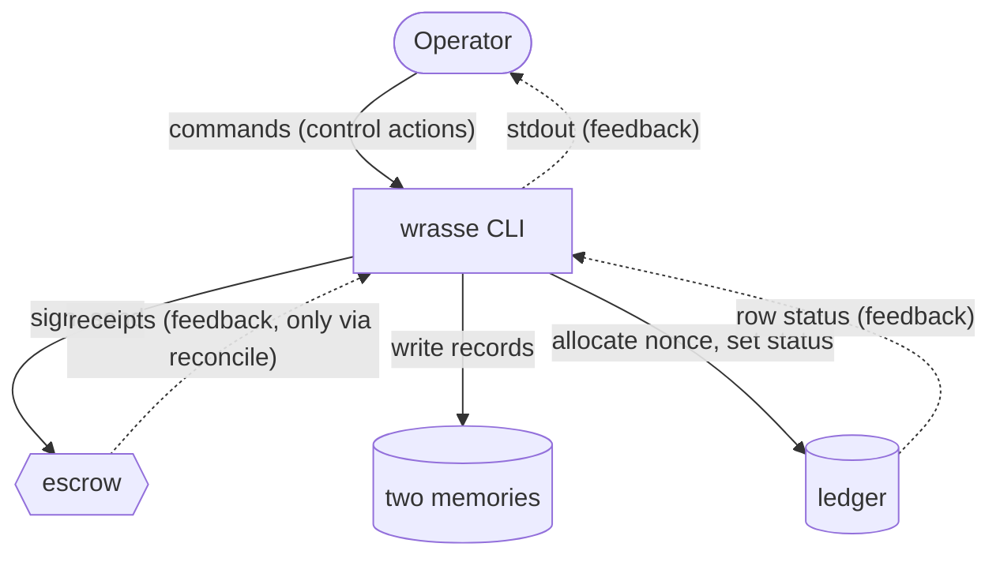

# 4. Control structure and unsafe actions

**One controller.** No keeper, no cron, no daemon, no agent with a key. Every control action is
a command a human typed. This deletes the entire class of automation failures and makes the
table below short.

**The controller's process model**, meaning what the operator believes about the system at the
moment they act, comes from exactly three places: `tx-status` output, `tx-resolve` verdicts, and
the last command's stdout. **Every one of those can be stale**, because chain time is read once
per resolver run rather than per row. The design compensates with a last-moment recheck
immediately before a resend, which is the case that can lose money.

## Unsafe control actions

| Control action | Not provided | Provided when it should not be | Too early / late / out of order | Stopped too soon or applied too long |
|---|---|---|---|---|
| `create-deal` | No deal exists. Safe. | Guarded: the document must rebuild from both memories, and both are **held** across the whole signing callback. | Deadline rechecked inside the callback, not at command start. | Process dies mid-send: row is `send_attempted`, nonce held, bytes may be live. **J3 recovers it.** |
| deal action (`accept-deal` etc.) | Deal expires on chain. | Guarded by contract role checks. | **A stale `tx-status` can prompt a second attempt.** `WalletBusy` refuses it. | Dies mid-send: same window. **Recovery currently blocked by `cli.py:1688`.** |
| `tx-resolve --rebroadcast` | Row stays unresolved, wallet held. | Guarded: same preconditions as a first send, plus a fresh deadline check. | Chain time read once per run, so a row's verdict can age within the run. | n/a |
| `reconcile` | **Memory never learns the outcome.** Silent. The next quote prices on an incomplete history. | Guarded: integrity check, then canonical-block check. | Marker-before-write makes an interrupted ingest visible rather than silent. | Interrupted: marker outstanding, quoting refuses. Fail-closed. |
| `learn-dimension` | New receipt has no dimension, quoting refuses with a named error. | `--relearn` changes term values with no evidence change. | Two learners: prevented by the write lock. | n/a |
| `policy` | No quote. Safe, read-only. | n/a | Reads dimensions inside the same snapshot as the recall. | n/a |

**The one that should worry you.** `reconcile` not being run is the only unsafe action in this
table that is **silent**. Everything else fails loudly. A settled deal that never reaches memory
means the next quote prices on a history missing its most recent receipt, and nothing on screen
says so. There is no alert, because there is no monitoring.

Mitigation available today: run `reconcile` immediately after every `tx-resolve` that reports
`confirmed_*`, and check that the receipt count in the next quote went up.
